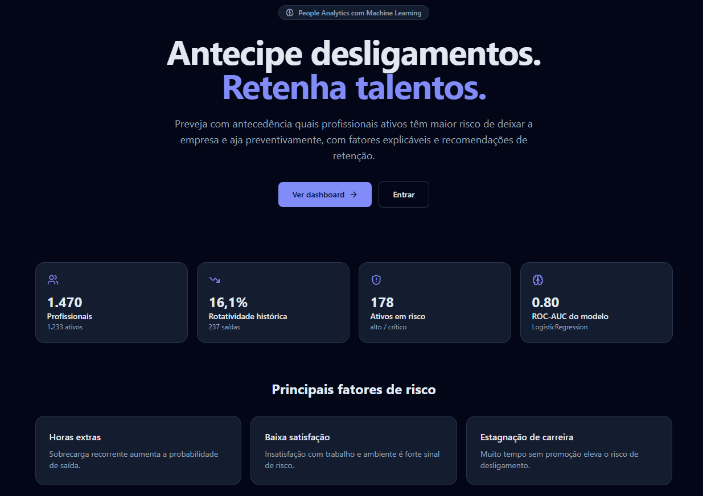
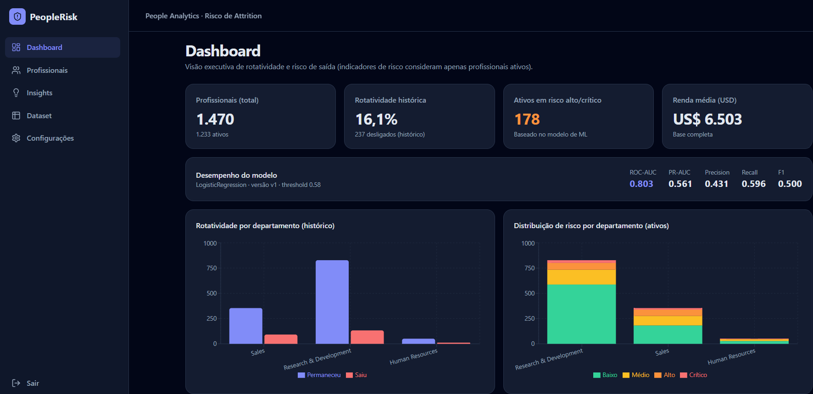
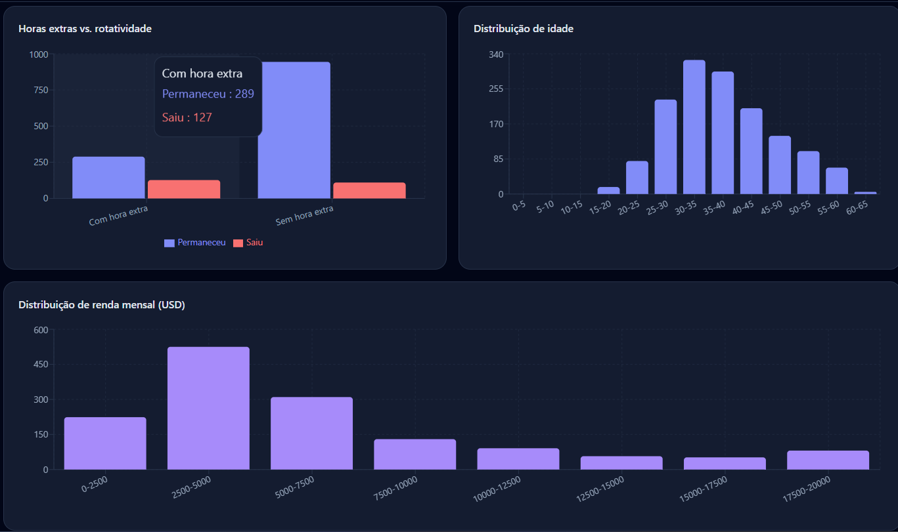
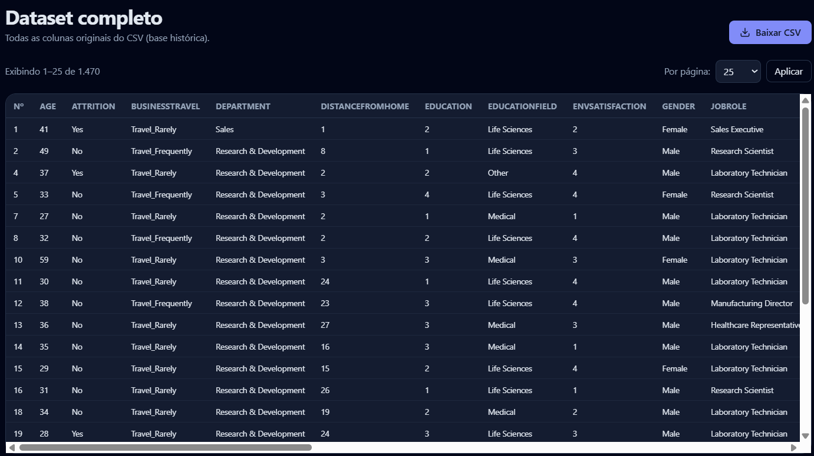
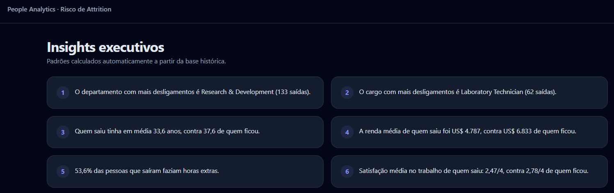
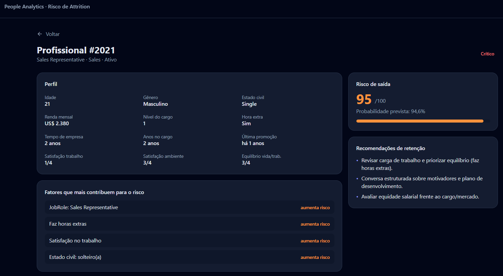
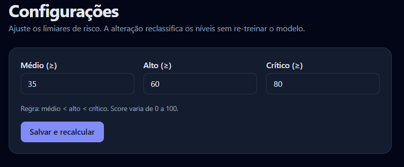
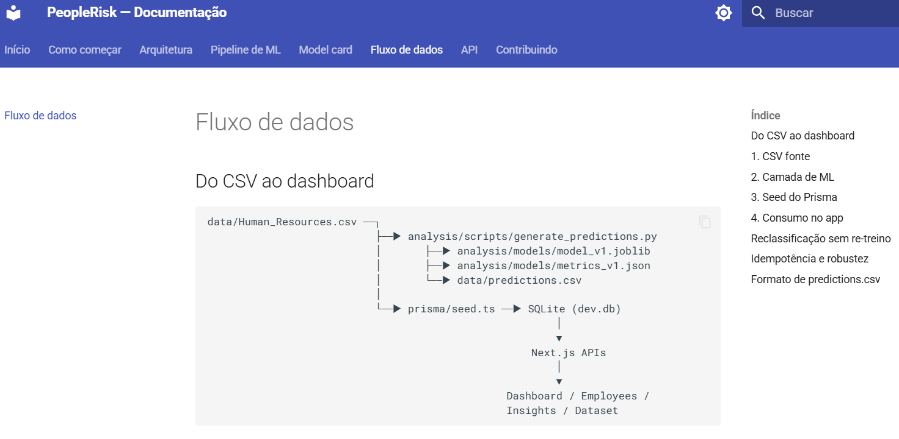

# PeopleRisk — People Analytics com Machine Learning

[](https://github.com/henriquebotelhogomes/Recursos_Humanos_ML/actions/workflows/ci.yml)

> Plataforma de RH que usa Machine Learning para prever, com antecedência, quais profissionais ativos têm maior risco de deixar a empresa, permitindo que RH e lideranças ajam preventivamente na retenção de talentos.

Projeto de **portfólio** que demonstra entrega ponta a ponta em ciência de dados/ML e engenharia de software full stack, com foco em arquitetura, modelagem, APIs, qualidade e deploy.

     

---

## Sumário

- [Sobre o projeto](#sobre-o-projeto)
- [Demonstração](#demonstração)
- [Arquitetura](#arquitetura)
- [Tecnologias](#tecnologias)
- [Modelo de Machine Learning](#modelo-de-machine-learning)
- [Tratamento dos dados do CSV](#tratamento-dos-dados-do-csv)
- [Como iniciar o projeto](#como-iniciar-o-projeto)
- [Rotas de API](#rotas-de-api)
- [Como testar](#como-testar)
- [Documentação (MkDocs)](#documentação-mkdocs)
- [Estrutura de diretórios](#estrutura-de-diretórios)
- [Limitações e uso responsável](#limitações-e-uso-responsável)

---

## Sobre o projeto

Rotatividade (attrition) gera custos altos para as empresas: recrutamento, treinamento, perda de conhecimento e queda de produtividade. Normalmente a empresa só descobre a saída quando o profissional já pediu desligamento — tarde demais para reter.

O **PeopleRisk** transforma a base histórica de RH em sinais **acionáveis e priorizáveis** de risco, com:

- Um **modelo supervisionado** treinado com o histórico de `Attrition` para prever a probabilidade de saída.
- **Explicabilidade individual**: os principais fatores que puxam o risco de cada profissional para cima.
- Um **dashboard executivo** com KPIs, gráficos e ranking de profissionais em risco.
- **Recomendações de retenção** baseadas em regras sobre os fatores de risco.

A base usada é o clássico **IBM HR Analytics** (1.470 profissionais, 35 colunas), sintética e pública.



## Demonstração

- **Local**: <http://localhost:3000>
- **Online (Render)**: https://people-risk.onrender.com

**Acesso demo**: `demo123` / `demo123` (há um botão "Preencher automaticamente" na tela de login)

Rotas principais:

| Rota                | Descrição                                                              |
| ------------------- | ---------------------------------------------------------------------- |
| `/`                 | Landing page com proposta de valor e métricas do modelo                |
| `/login`            | Login (aceita o usuário demo)                                          |
| `/register`         | Cadastro de novo usuário (auto-login após criar)                       |
| `/dashboard`        | KPIs, gráficos e painel de desempenho do modelo                        |
| `/employees`        | Lista filtrável ordenada por risco                                     |
| `/employees/[id]`   | Detalhe com probabilidade, fatores de risco e recomendações            |
| `/insights`         | Insights executivos gerados a partir dos dados                         |
| `/dataset`          | Todas as 35 colunas do CSV, paginado (25/50/100/200/500/1000) + download |
| `/settings`         | Ajuste dos thresholds de risco (reclassifica sem re-treinar)           |



## Arquitetura

Duas camadas separadas, comunicando-se via arquivo:

```
┌──────────────────────────┐              ┌────────────────────────────┐
│ Camada de ML (Python)    │              │ App Web (Next.js)          │
│                          │              │                            │
│  analysis/hr_analytics   │──gera──▶     │  data/predictions.csv      │
│  scikit-learn            │              │  ↓                         │
│  train → evaluate → SHAP │              │  prisma/seed.ts (carga)    │
│                          │              │  ↓                         │
│  models/model_v1.joblib  │              │  SQLite (Prisma)           │
│  models/metrics_v1.json  │              │  ↓                         │
└──────────────────────────┘              │  App Router / API Routes   │
                                          │  ↓                         │
                                          │  Dashboard / Employees /   │
                                          │  Insights / Dataset        │
                                          └────────────────────────────┘
```

### Princípios

- **Batch scoring**: o app **não treina** modelo — apenas consome predições persistidas. Isso mantém a UI rápida, permite reprodutibilidade e evita acoplamento a runtime Python em produção.
- **Separação por camadas** no app: `app/` (rotas/UI), `components/` (visual), `lib/` (regras puras), `server/services/` (agregações e regras de negócio), `prisma/` (persistência).
- **Reclassificação sem re-treino**: ajustar thresholds em `/settings` só reaplica os cortes sobre a `attritionProbability` já prevista — o modelo não muda.
- **Ativos vs. desligados**: modelo é treinado com ambos, mas o produto mostra risco **apenas de ativos**; métricas históricas (rotatividade) são explicitamente rotuladas.

## Tecnologias

**Frontend/Backend**
- [Next.js 15](https://nextjs.org/) (App Router, Server Components, Route Handlers)
- TypeScript (strict), Tailwind CSS
- [Prisma ORM](https://www.prisma.io/) + SQLite (dev)
- [NextAuth.js](https://next-auth.js.org/) (credenciais + bcrypt)
- [Zod](https://zod.dev/) (validação), [Recharts](https://recharts.org/) (gráficos)
- [PapaParse](https://www.papaparse.com/) (leitura de CSV no seed)
- Lucide Icons, `clsx`, `tailwind-merge`
- FastAPI (serviço de inferência online embutido no mesmo container)

**Machine Learning**
- Python 3.12
- pandas, numpy
- scikit-learn (Pipeline, ColumnTransformer, LogisticRegression, GradientBoostingClassifier, StratifiedKFold, GridSearch/CV, métricas)
- shap (LinearExplainer/TreeExplainer) + matplotlib (gráficos SHAP)
- joblib (serialização)

**Qualidade e docs**
- Vitest (testes unitários em `tests/unit`)
- pytest (testes da camada ML em `analysis/tests`)
- Playwright (fluxos E2E em `tests/e2e`)
- Ruff (lint Python via `pyproject.toml`)
- Pyright (type-check da camada Python via `pyrightconfig.json`)
- **MkDocs + Material for MkDocs** (implementado)

## Modelo de Machine Learning

### Definição do problema

- Tarefa: **classificação binária supervisionada**
- Alvo: `Attrition` (Yes = 1 = saiu; No = 0 = permaneceu)
- Saída principal: `attritionProbability` (0–1)
- Derivadas: `riskScore = probability * 100` e `riskLevel` (LOW/MEDIUM/HIGH/CRITICAL) por thresholds configuráveis.

### Pipeline (`analysis/hr_analytics/`)

1. **Carga e limpeza** (`loading.py`)  
   Remove colunas constantes/sem informação preditiva: `EmployeeCount`, `Over18`, `StandardHours`.  
   `EmployeeNumber` é usado apenas como identificador, **nunca como feature**.

2. **Features** (`features.py`)  
   Encapsula todo o pré-processamento em um **`ColumnTransformer` + `Pipeline`** do scikit-learn:
   - Numéricas → `StandardScaler`
   - Categóricas (`BusinessTravel`, `Department`, `EducationField`, `Gender`, `JobRole`, `MaritalStatus`, `OverTime`) → `OneHotEncoder(handle_unknown="ignore")`  
   Isso garante **fit apenas no treino** e evita **data leakage**.

3. **Treino e seleção** (`train.py`)  
   Compara dois algoritmos por **ROC-AUC** em `StratifiedKFold(n_splits=5)`:
   - **Regressão Logística** (baseline interpretável, `class_weight='balanced'` para o desbalanceamento)
   - **Gradient Boosting** (scikit-learn)  
   Split estratificado 80/20 preserva a proporção de saídas (~16%). `random_state=42` para reprodutibilidade.

4. **Avaliação** (`evaluate.py`)  
   Métricas obrigatórias para problema **desbalanceado** (accuracy não é a principal):
   - **ROC-AUC** (métrica principal)
   - **PR-AUC** (average precision)
   - Precision / Recall / F1 para a classe positiva
   - Matriz de confusão
   - Escolha do **threshold** de decisão maximizando F1 no holdout

5. **Explicabilidade local** (`score.py`)  
   O pipeline final gera explicações nativas com **SHAP**: `shap.LinearExplainer` para `LogisticRegression` e `shap.TreeExplainer` para `GradientBoosting`. Para cada profissional, os SHAP values mais relevantes formam o `topRiskFactors` exibido no detalhe, com direção de impacto (`aumenta`/`reduz`).

6. **Scoring e persistência** (`scripts/generate_predictions.py`)  
   Gera `data/predictions.csv` com colunas: `EmployeeNumber`, `attritionProbability`, `predictedAttrition`, `modelVersion`, `topRiskFactors` (JSON).  
   Salva também `analysis/models/model_v1.joblib`, `analysis/models/metrics_v1.json` (métricas + metadados) e gráficos SHAP em `analysis/reports/`.

### Resultados do modelo v1

Modelo selecionado por CV: **LogisticRegression**

| Métrica       | CV (train)                   | Holdout (test) |
| ------------- | ---------------------------- | -------------- |
| ROC-AUC       | 0.827 (LR) / 0.813 (GB)     | **0.803**      |
| PR-AUC        | —                            | 0.561          |
| Precision     | —                            | 0.431          |
| Recall        | —                            | **0.596**      |
| F1            | —                            | 0.500          |
| Threshold     | —                            | 0.58 (F1 opt)  |

O modelo consegue **ranquear** bem os profissionais em risco (ROC-AUC ~0.80) e prioriza **recall** para a classe minoritária — coerente com o negócio: prefere-se alertar demais e conversar do que perder um talento silenciosamente.



## Tratamento dos dados do CSV

O `data/Human_Resources.csv` (fonte fixa do projeto, também presente na raiz como `Human_Resources.csv` para referência) é tratado em três lugares distintos, cada um com responsabilidade clara:

### 1. Pipeline de ML (Python)

- Leitura com `pandas.read_csv`.
- **Drop** de colunas constantes: `EmployeeCount`, `Over18`, `StandardHours`.
- **Separação** X / y: `y = (Attrition == "Yes").astype(int)`; `X` remove `Attrition` e `EmployeeNumber`.
- **Encoding e escala** aplicados apenas via `Pipeline` — nunca ajustados no dataset inteiro antes do split (para não vazar).

### 2. Seed do Prisma (Node/TypeScript)

- Leitura com PapaParse (`prisma/seed.ts`).
- **Carga idempotente**: `deleteMany()` + `create()` por linha (chave única `employeeNumber`).
- **Cruzamento** com `data/predictions.csv` (por `EmployeeNumber`) para gravar `attritionProbability`, `predictedAttrition`, `riskScore`, `riskLevel`, `topRiskFactors`, `modelVersion`, `scoredAt`.
- Deriva `isActive = (Attrition !== "Yes")`.
- **Robusto**: se `predictions.csv` não existir, a base é carregada mesmo assim (campos de risco ficam `null`) e o dashboard exibe um aviso.
- Cria o **usuário demo** com senha bcrypt.
- Registra a `ModelRun` a partir de `analysis/models/metrics_v1.json` e cria a `RiskConfig` inicial (thresholds 35/60/80).

### 3. Consumo no app

- Todas as leituras vêm do banco via **Prisma**; nenhuma agregação em memória a partir do CSV.
- **KPIs de risco** consideram apenas ativos; **rotatividade histórica** usa a base inteira e é rotulada como tal.
- `/dataset` mostra a base crua paginada e exporta CSV via `/api/dataset/download`.









## Como iniciar o projeto

### Pré-requisitos

- **Node.js 20+** e **npm**
- **Python 3.11+**
- Pacotes Python: `pandas`, `numpy`, `scikit-learn`, `shap`, `matplotlib`, `joblib`

### Passo a passo

```bash
# 1. Clonar e entrar na pasta
git clone <URL_DO_REPO> Recursos_Humanos
cd Recursos_Humanos

# 2. Camada de ML (Python) — treina e gera predições
python -m analysis.scripts.generate_predictions
# Produz: data/predictions.csv, analysis/models/model_v1.joblib, analysis/models/metrics_v1.json

# 3. App (Next.js)
npm install
npx prisma migrate dev            # cria dev.db e roda o seed automaticamente
# (o seed carrega CSV + predições, cria usuário demo e RiskConfig)

# 4. Rodar em desenvolvimento
npm run dev
```

Acesse <http://localhost:3000> e faça login com **`demo123` / `demo123`**.

### Variáveis de ambiente (`.env`)

```
DATABASE_URL="file:./dev.db"
NEXTAUTH_SECRET="troque-este-secret-em-producao"
NEXTAUTH_URL="http://localhost:3000"
```

### Comandos úteis

| Comando                                                    | O que faz                                                    |
| ---------------------------------------------------------- | ------------------------------------------------------------ |
| `npm run dev`                                              | Sobe o app em modo desenvolvimento                           |
| `npm run build && npm start`                               | Build de produção                                            |
| `npx prisma db seed`                                       | Re-carrega o banco a partir do CSV + predictions.csv         |
| `npm run db:seed`                                          | Atalho equivalente ao `npx prisma db seed`                   |
| `npx prisma studio`                                        | GUI para inspecionar o SQLite                                |
| `python -m analysis.scripts.generate_predictions`          | Re-treina o modelo e regenera as predições                   |
| `docker build -t people-risk .`                           | Build da imagem Docker                                       |
| `docker run -p 3000:3000 people-risk`                      | Executa o container localmente                               |

### Inferência online (FastAPI)

- Endpoints:
  - `GET /health`
  - `GET /model-info`
  - `POST /predict`
  - `POST /predict/batch`
- O app Next.js pode consumir inferência online quando `USE_ONLINE_INFERENCE=true`.
- Em Docker, Next.js (porta 3000) e FastAPI (porta 8000) sobem juntos na mesma imagem.

Variáveis úteis:

```
USE_ONLINE_INFERENCE=false
INFERENCE_BASE_URL=http://127.0.0.1:8000
INFERENCE_API_KEY=
MODEL_PATH=analysis/models/model_v1.joblib
RISK_THRESHOLD_MEDIUM=35
RISK_THRESHOLD_HIGH=60
RISK_THRESHOLD_CRITICAL=80
```

### Rotas de API

| Rota                          | Método | Descrição                                           |
| ----------------------------- | ------ | --------------------------------------------------- |
| `/api/auth/[...nextauth]`     | *      | Handler NextAuth (login, sessão, logout)            |
| `/api/register`               | POST   | Cadastro de novo usuário                            |
| `/api/employees`              | GET    | Lista de profissionais (filtros, paginação e busca) |
| `/api/dataset/download`       | GET    | Download do CSV completo (attachment)               |
| `/api/metrics`                | GET    | KPIs e agregações do dashboard                      |
| `/api/settings`               | GET/PUT| Leitura e gravação do RiskConfig                    |

### Docker local (opcional)

```bash
# Build da imagem
docker build -t people-risk .

# Executar
docker run -p 3000:3000 \
  -e NEXTAUTH_URL=http://localhost:3000 \
  -e NEXTAUTH_SECRET=qualquer-secret-local \
  people-risk
```

## Como testar

### Testes de rota e fluxo

Após subir o app:

1. Acesse `/` → deve exibir a landing com KPIs reais.
2. Faça login com o usuário demo.
3. Verifique `/dashboard` (KPIs, gráficos, painel do modelo).
4. Em `/employees`, ordene por risco e abra um profissional em risco alto — cheque os fatores e as recomendações.
5. Em `/dataset`, teste a paginação (25/50/…/1000) e o botão **Baixar CSV**.
6. Em `/settings`, altere um threshold e observe a reclassificação (o app mostra quantos profissionais foram reclassificados).
7. `/insights` deve gerar textos com números calculados a partir do banco.

### Testes automatizados

Suítes implementadas:

- `tests/unit/` (Vitest): regras de risco, recomendações e validações Zod.
- `tests/integration/` (Vitest): rotas `/api/metrics`, `/api/settings` e `/api/employees`.
- `tests/e2e/` (Playwright): autenticação ponta a ponta (rota protegida, login válido/inválido, cadastro com auto-login, logout) e fluxos protegidos (`/employees`, `/dataset`, `/insights`, `/settings`).
- `analysis/tests/` (pytest): loading/cleaning, feature engineering e avaliação.

Comandos:

```bash
npm run test        # roda os testes TS com Vitest
npm run test:cov    # cobertura
npm run test:e2e    # fluxos E2E com Playwright
pytest              # testes Python
```

### Cobertura de testes (TypeScript)

A cobertura dos testes TypeScript roda no CI com `npm run test:cov`.

Referência local do último run:

- Statements: **68.71%**
- Branches: **44.57%**
- Functions: **24.44%**
- Lines: **11.51%**

## Documentação (MkDocs)

A documentação completa é gerada com **MkDocs + Material for MkDocs**:

```bash
# Instalar (uma vez)
pip install mkdocs mkdocs-material

# Servir localmente (porta configurada em mkdocs.yml → dev_addr)
mkdocs serve       # http://127.0.0.1:8765

# Gerar site estático
mkdocs build       # saída em site/
```

!!! tip "Por que a porta 8765?"
    A porta padrão do MkDocs é a **8000**. Em alguns ambientes Windows ela pode estar indisponível (por conflito de porta), então este projeto usa **127.0.0.1:8765** em `mkdocs.yml` (`dev_addr`). Se quiser trocar, edite `dev_addr` ou use `mkdocs serve --dev-addr 127.0.0.1:PORTA`.

Conteúdo:

| Página                     | O que documenta                                          |
| -------------------------- | -------------------------------------------------------- |
| `docs/index.md`            | Visão geral do produto                                   |
| `docs/getting-started.md`  | Instalação e execução                                    |
| `docs/architecture.md`     | Arquitetura e árvore de diretórios                       |
| `docs/ml-pipeline.md`      | Pipeline de ML (pré-processamento, treino, scoring)      |
| `docs/risk-model.md`       | **Model card** (features, métricas, limitações, vieses) |
| `docs/data-pipeline.md`    | Fluxo CSV → predições → banco                            |
| `docs/api.md`              | Referência das rotas de API                              |
| `docs/contributing.md`     | Padrões de código e testes                               |



## Estrutura de diretórios

```
Recursos_Humanos/
├── analysis/               # Camada de ML (Python)
│   ├── hr_analytics/       # Pacote: loading, features, train, evaluate, score
│   ├── scripts/            # generate_predictions.py, train_model.py
│   ├── models/             # model_v1.joblib (gitignored) + metrics_v1.json
│   └── reports/            # Curvas ROC/PR, matriz de confusão (PNG)
├── data/
│   ├── Human_Resources.csv # Fonte fixa (cópia em data/)
│   └── predictions.csv     # Gerado pelo ML
├── docs/                   # Documentação MkDocs
├── prisma/
│   ├── schema.prisma       # User, Employee, RiskConfig, ModelRun
│   ├── seed.ts             # Carrega CSV + predições + usuário demo
│   └── dev.db              # SQLite (gerado, gitignored)
├── scripts/                # Scripts utilitários (em branco, reservado)
├── src/
│   ├── app/                # App Router (marketing, auth, dashboard, api)
│   ├── components/         # ui, layout, charts, dashboard, employees, dataset, marketing, settings
│   ├── config/             # site.ts, constants
│   ├── lib/                # prisma.ts, auth, risk, utils, validations
│   ├── server/services/    # metrics, model
│   ├── hooks/              # Hooks React customizados
│   ├── types/              # Tipos globais TypeScript
│   ├── styles/             # Estilos adicionais
│   └── middleware.ts       # Proteção de rotas
├── tests/                  # Testes unitários e de integração (Vitest)
│   ├── unit/               # risk, metrics, csv, validations
│   ├── integration/        # api-employees, api-metrics, api-settings
│   └── fixtures/           # sample_hr.csv para testes
├── Dockerfile
├── .dockerignore
├── mkdocs.yml
├── package.json
├── tsconfig.json
├── tailwind.config.ts
├── next.config.ts
├── .env.example
└── README.md
```

## Limitações e uso responsável

- O dataset é **sintético e público** (IBM HR Analytics). As predições são demonstrativas.
- **Correlação não implica causalidade** — o modelo indica risco, não a causa.
- Ferramenta de **apoio à decisão** de RH, não deve ser usada isoladamente para decisões de desligamento.
- Documentar sempre a análise de vieses (ex.: por gênero) no *model card* (`docs/risk-model.md`).

### Status do projeto

- **CI/CD** com GitHub Actions implementado (`.github/workflows/ci.yml`) com lint, testes e build em push/PR.
- Cobertura E2E (Playwright) e cenários de autenticação completos implementados.
- Explicabilidade com SHAP nativo (`shap.LinearExplainer` / `shap.TreeExplainer`) e geração de gráficos implementada.
- Serviço de inferência online (FastAPI) e re-treino agendado implementados.

---

**PeopleRisk** · Projeto de portfólio · Dados IBM HR Analytics (sintéticos) · Licença MIT
